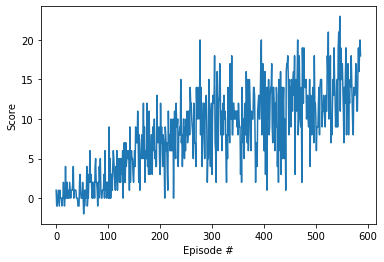

Banana - reinforcement learning DQN implementation
============

Banana is a deep Q learning implementation of DQN paper

Project 1: Navigation

## Introduction

For this project, you will train an agent to navigate (and collect bananas!) in a large, square world.  

A reward of +1 is provided for collecting a yellow banana, and a reward of -1 is provided for collecting a blue banana.  Thus, the goal of your agent is to collect as many yellow bananas as possible while avoiding blue bananas.  

The state space has 37 dimensions and contains the agent's velocity, along with ray-based perception of objects around agent's forward direction.  Given this information, the agent has to learn how to best select actions.  Four discrete actions are available, corresponding to:
- **`0`** - move forward.
- **`1`** - move backward.
- **`2`** - turn left.
- **`3`** - turn right.

The task is episodic, and in order to solve the environment, your agent must get an average score of +13 over 100 consecutive episodes.

## Getting Started

1. Download the environment from one of the links below.  You need only select the environment that matches your operating system:
    - Linux: [click here](https://s3-us-west-1.amazonaws.com/udacity-drlnd/P1/Banana/Banana_Linux.zip)
    - Mac OSX: [click here](https://s3-us-west-1.amazonaws.com/udacity-drlnd/P1/Banana/Banana.app.zip)
    - Windows (32-bit): [click here](https://s3-us-west-1.amazonaws.com/udacity-drlnd/P1/Banana/Banana_Windows_x86.zip)
    - Windows (64-bit): [click here](https://s3-us-west-1.amazonaws.com/udacity-drlnd/P1/Banana/Banana_Windows_x86_64.zip)
    
    (_For Windows users_) Check out [this link](https://support.microsoft.com/en-us/help/827218/how-to-determine-whether-a-computer-is-running-a-32-bit-version-or-64) if you need help with determining if your computer is running a 32-bit version or 64-bit version of the Windows operating system.

    (_For AWS_) If you'd like to train the agent on AWS (and have not [enabled a virtual screen](https://github.com/Unity-Technologies/ml-agents/blob/master/docs/Training-on-Amazon-Web-Service.md)), then please use [this link](https://s3-us-west-1.amazonaws.com/udacity-drlnd/P1/Banana/Banana_Linux_NoVis.zip) to obtain the environment.

##Implementation
The project was solved using deep reinforcement learning, more specifically a Deep Q-Network. The code was based upon the Luna example from the Udacity Deep Reinforcement Learning GitHub repo (h  ttps://github.com/udacity/deep-reinforcement-
l earning/tree/master/dqn). This was modified and updated to work with the Unity-ML environment and extended with new model architecture.
•	The Jupyter notebook Navigation.ipynb contains the implementation for training the agent in the environment.
•	dqn_agent.py contains the Deep Q-learning agent which interacts with the environment to optimize the reward.
•	model.py contains the Neural Network which takes in the input state and outputs the desired Q-values

## Results
The results from the DQN were impressive. It easily achieved an average score of 13 pretty easily in 491 episodes.

Episode 100	Average Score: 0.99

Episode 200	Average Score: 5.11

Episode 300	Average Score: 8.40

Episode 400	Average Score: 10.18

Episode 500	Average Score: 11.54

Episode 587	Average Score: 13.06

Environment solved in 587 episodes!	Average Score: 13.06

 
Place the file in the directory of GitHub repository files.

Environment is considered solved if average of 100 episodes is more than 13.
Running a script is not a problem. Just execute it in sequential order.

